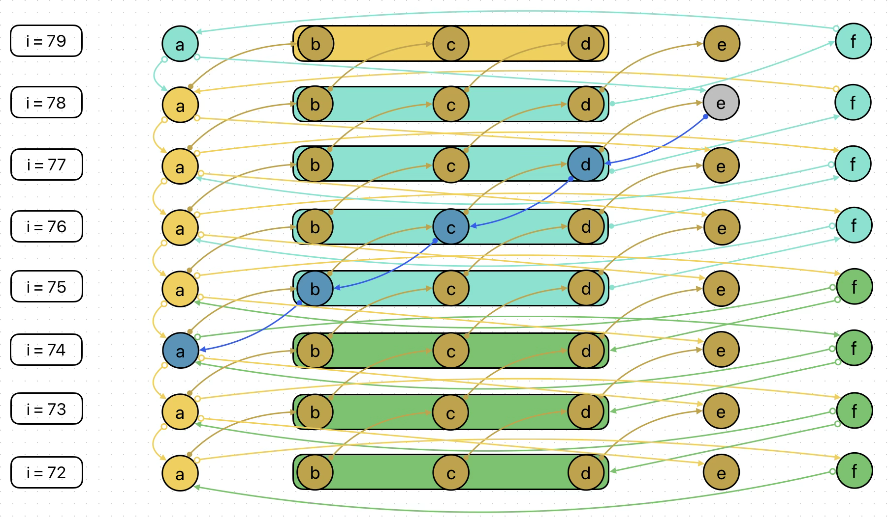

# SHA-1 analysis

This document is a reflection on the impossibility of reversing data from a SHA-1 hash without bruteforce.
## Menu
 - [Basic Knowledge](#basic-knowledge)
 - [The Equation of e](#the-equation-of-e)
 - [The Equation of w](#the-equation-of-w)
 - [Constancy](#constancy)
 - [Possibilities](#possibilities)
 - [Rotation](#rotation)
 - [e and w](#e-and-w)
 - [Error propagation](#error-propagation)
 - [Unbounded value](#unbounded-value)

## Basic Knowledge

### SHA-1 Register Relations (Forward) :
```math
registers = 
\begin{cases}
a_i = (\_left\_rotate(a_{i-1}, 5) + f_i + e_{i-1} + k_{i} + w_i) \land 4294967295 \\
a_i = (\left( (a_{i-1} \ll 5) \mid (a_{i-1} \gg 27) \right) + f_i + e_{i-1} + k_{i} + w_i) \land 4294967295 \\
b_i = (a_{i-1}) \land 4294967295 \\
c_i = (\_left\_rotate(b_{i-1}, 30)) \land 4294967295 \\
c_i = ((b_{i-1} \ll 30) \mid (b_{i-1} \gg 2)) \land 4294967295 \\
d_i = (c_{i-1}) \land 4294967295 \\
e_i = (d_{i-1}) \land 4294967295
\end{cases}
```
<br>

if $0 \leqslant i \lt 20$ :
```math
f_i = (d_{i-1} \oplus \left( b_{i-1} \land (c_{i-1} \oplus d_{i-1}) \right)) \land 4294967295
```

if $20 \leqslant i \lt 40$ :
```math
f_i = (b_{i-1} \oplus c_{i-1} \oplus d_{i-1}) \land 4294967295
```

if $40 \leqslant i \lt 60$ :
```math
f_i = ((b_{i-1} \land c_{i-1}) \lor (b_{i-1} \land d_{i-1}) \lor (c_{i-1} \land d_{i-1})) \land 4294967295
```

if $60 \leqslant i \lt 80$ :
```math
f_i = (b_{i-1} \oplus c_{i-1} \oplus d_{i-1}) \land 4294967295
```

### SHA-1 Register Relations (Backward) :
```math
registers =
\begin{cases}
d_{i-1} = (e_i) \land 4294967295 \\
c_{i-1} = (d_i) \land 4294967295 \\
b_{i-1} = (\_left\_rotate(c_i, 2)) \land 4294967295 \\
b_{i-1} = ((c_i \ll 2) \mid (c_i \gg 30)) \land 4294967295 \\
a_{i-1} = (b_i) \land 4294967295
\end{cases}
```

if $0 \leqslant i \lt 20$ :
```math
\begin{align}
f_{i-1} &= (e_i \oplus \left( \_left\_rotate(c_i, 2) \land (d_i \oplus e_i) \right)) \land 4294967295 \\
f_{i-1} &= (e_i \oplus \left( \left( (c_i \ll 2) \mid (c_i \gg 30) \right) \land (d_i \oplus e_i) \right)) \land 4294967295
\end{align}
```

if $20 \leqslant i \lt 40$ :
```math
\begin{align}
f_{i-1} &= (\_left\_rotate(c_i, 2) \oplus d_i \oplus e_i) \land 4294967295 \\
f_{i-1} &= (\left( (c_i \ll 2) \mid (c_i \gg 30) \right) \oplus d_i \oplus e_i) \land 4294967295
\end{align}
```

if $40 \leqslant i \lt 60$ :
```math
\begin{align}
f_{i-1} &= ((\_left\_rotate(c_i, 2) \land d_i) \lor (\_left\_rotate(c_i, 2) \land e_i) \lor (d_i \land e_i)) \land 4294967295 \\
f_{i-1} &= ((\left( (c_i \ll 2) \mid (c_i \gg 30) \right) \land d_i) \lor (\left( (c_i \ll 2) \mid (c_i \gg 30) \right) \land e_i) \lor (d_i \land e_i)) \land 4294967295
\end{align}
```

if $60 \leqslant i \lt$ 80 :
```math
\begin{align}
f_{i-1} &= (\_left\_rotate(c_i, 2) \oplus d_i \oplus e_i) \land 4294967295 \\
f_{i-1} &= (\left( (c_i \ll 2) \mid (c_i \gg 30) \right) \oplus d_i \oplus e_i) \land 4294967295
\end{align}
```

## The Equation of $e$

In SHA-1, some information is lost between rounds : the value of register $e$ at round $i$ is no longer accessible at round $i+1$.

However, we can use the equation of $a_{i+1}$ to recover $e_i$, provided we have the initial data ($w$). While $e_i$ appears to be lost at round $i+1$, the definition of $a_{i+1}$ is:

```math
\begin{align}
a_{i+1} &= (\_left\_rotate(a_i, 5) + f_{i+1} + e_i + k_{i+1} + w_{i+1}) \land 4294967295 \\
a_{i+1} &= (\left( (a_i \ll 5) \mid (a_i \gg 27) \right) + f_{i+1} + e_i + k_{i+1} + w_{i+1}) \land 4294967295
\end{align}
```

Which is equivalent to :

```math
\begin{align}
a_{i+1} &= (\_left\_rotate(b_{i+1}, 5) + f_{i+1} + e_i + k_{i+1} + w_{i+1}) \land 4294967295 \\
a_{i+1} &= (\left( (b_{i+1} \ll 5) \mid (b_{i+1} \gg 27) \right) + f_{i+1} + e_i + k_{i+1} + w_{i+1}) \land 4294967295
\end{align}
```
<br>

And since we know the initial data, we also know $w_i$, so the only unknown in this equation is $e_i$ :

```math
\begin{align}
e_i &= (a_{i+1} - \left( \_left\_rotate(a_i, 5) + f_{i+1} + k_{i+1} + w_{i+1} \right)) \land 4294967295 \\
e_{i} &= (a_{i+1} - \left( \left( (a_i \ll 5) \mid (a_i \gg 27) \right) + f_{i+1} + k_{i+1} + w_{i+1} \right)) \land 4294967295
\end{align}
```

## The Equation of $w$

In SHA-1, $w_0$ through $w_{15}$ correspond to the input chunk, and the subsequent words $w_{16}$ to $w_{79}$ are computed from this initial chunk.
The operation from $w_{16}$ to $w_{79}$ is :

```math
\begin{align}
w_{i} &= (\_left\_rotate( w_{i - 3} \oplus w_{i - 8} \oplus w_{i - 14} \oplus w_{i - 16},\, 1)) \land 4294967295 \\
w_{i} &= (\left( \left( w_{i - 3} \oplus w_{i - 8} \oplus w_{i - 14} \oplus w_{i - 16} \right) \ll 1 \right) \mid \left( \left( w_{i - 3} \oplus w_{i - 8} \oplus w_{i - 14} \oplus w_{i - 16} \right) \gg 31 \right)) \land 4294967295
\end{align}
```
<br>
And the equation is :

```math
\begin{align}
w_{i} &= (a_{i} - ( \_left\_rotate(a_{i-1},\, 5) + f_{i} + e_{i-1} + k_{i})) \land 4294967295 \\
w_{i} &= (a_{i} - (((a_{i-1} \ll 5) \mid (a_{i-1} \gg 27)) + f_{i} + e_{i-1} + k_{i})) \land 4294967295
\end{align}
```
<br>

But even if you know the result of the equation ($w_i$), there are still too many possible values.  
For example, let's take $w_{50} = 1000$ :

```math
\begin{align}
w_{50} = (\_left\_rotate( w_{47} \oplus w_{42} \oplus w_{36} \oplus w_{34},\, 1)) \land 4294967295 = 1000
\end{align}
```

In this kind of equation — `((a ^ b ^ c ^ d) << 1) | ((a ^ b ^ c ^ d) >> 31) = x` — where $a, b, c, d$ are 32-bit values in the range $[0;4294967295]$, the total number of possible combinations for $(a, b, c)$ is $2^{96} = 79228162514264337593543950336$.

## Constancy

In SHA-1, there is also consistency in the initial values :  

```math
\begin{align}
a_0 &= 1732584193 \\
b_0 &= 4023233417 \\
c_0 &= 2562383102 \\
d_0 &= 271733878 \\
e_0 &= 3285377520
\end{align}
```

And so :  

```
i=5  : a =           , b =           , c =           , d =           , e =
i=4  : a =           , b =           , c =           , d =           , e = 1506887872
i=3  : a =           , b =           , c =           , d = 1506887872, e = 2079550178
i=2  : a =           , b =           , c = 1506887872, d = 2079550178, e = 2562383102
i=1  : a =           , b = 1732584193, c = 2079550178, d = 2562383102, e = 271733878
i=0  : a = 1732584193, b = 4023233417, c = 2562383102, d = 271733878 , e = 3285377520
```

## Possibilities

### one register
$2^{32} = 4294967296$

### $w_0$ through $w_{15}$

$(2^{32})^{16} = 13407807929942597099574024998205846127479365820592393377723561443721764030073546976801874298166903427690031858186486050853753882811946569946433649006084096$

### $w_0$ through $w_{79}$

$(2^{32})^{80} = 433300210274926779301235722995130529126851924312253566276831366547097655953268278873591999368453759375352459120642109169274240110620843517970102311224458427564046616227161115801662152359395451958893835480905010246703239443701925453743683726938789767940577524555724362397039358587448248740993955708382317083531851133758531532844694304737183093418571190053292997716413815714417740434254315670267335553209606545389900958653541702218767662872949109999460596999125719155768466778443229719919179735890978537026576050107500869340314188887101095263339865901080787145771915722368720844521851040375582291274824574444462419841916186875058374404329003250698574832235855871168399140082282900718430116575617097058691735266917705341386171618452673063526784039252631042036988932549246976$

## Rotation

You can rotate the problem from $w$ to $f$ when $20 \leqslant i \lt 40$ and when $60 \leqslant i \lt 80$ :

```math
\begin{align}
f_i &= (b_{i-1} \oplus c_{i-1} \oplus d_{i-1}) \land 4294967295 \\
b_{i-1} &= (f_i \oplus c_{i-1} \oplus d_{i-1}) \land 4294967295 \\
c_{i-1} &= (b_{i-1} \oplus f_i \oplus d_{i-1}) \land 4294967295 \\
d_{i-1} &= (b_{i-1} \oplus c_{i-1} \oplus f_i) \land 4294967295 \\

e_i &= d_{i-1} = (b_{i-1} \oplus c_{i-1} \oplus f_i) \land 4294967295 \\
e_{i-1} &= d_{i-2} = (b_{i-2} \oplus c_{i-2} \oplus f_{i-1}) \land 4294967295 \\
e_{i-2} &= d_{i-3} = (b_{i-3} \oplus c_{i-3} \oplus f_{i-2}) \land 4294967295 \\

a_i &= (\_left\_rotate(a_{i-1}, 5) + f_i + (b_{i-2} \oplus c_{i-2} \oplus f_{i-1}) + k_{i} + w_i) \land 4294967295 \\
w_i &= (a_{i} - (\_left\_rotate(a_{i-1},\, 5) + f_{i} + (d_{i-2} = b_{i-2} \oplus c_{i-2} \oplus f_{i-1}) + k_{i})) \land 4294967295 \\
w_{i-1} &= (b_{i} - (\_left\_rotate(\_left\_rotate(c_i,\, 2),\, 5) + f_{i-1} + (b_{i-3} \oplus c_{i-3} \oplus f_{i-2}) + k_{i-1})) \land 4294967295 \\
f_{i-1} &= (e_{i-1} \oplus (\_left\_rotate(c_i,\, 2) \land (d_{i-1} \oplus e_{i-1}))) \land 4294967295 \\
f_{i-1} &= ((b_{i-2} \oplus c_{i-2} \oplus f_{i-1}) \oplus (\_left\_rotate(c_i,\, 2) \land ((d_{i-1} \oplus (b_{i-2} \oplus c_{i-2} \oplus f_{i-1})))) \land 4294967295 \\
w_{i+1} + (b_{i-1} \oplus c_{i-1} \oplus f_i) &= (a_{i+1} - (\_left\_rotate(a_i,\, 5) - f_{i+1} - k_{i+1})) \land 4294967295
\end{align}
```

## e and w

These formulas can calculate the size of the two unknows :

```math
\begin{align}
w_{i+1} + e_i &= (a_{i+1} - (\_left\_rotate(a_i,\, 5) + f_{i+1} + k_{i+1})) \land 4294967295 \\
w_i + e_{i-1} &= (a_i - (\_left\_rotate(a_{i-1},\, 5) + f_i + k_i)) \land 4294967295
\end{align}
```

For example :
```math
\begin{align}
(w_{79} + e_{78}) \land 4294967295 = 2554260970
\end{align}
```

The absolute total number of possible values for this is `4294967296`, instead of `18446744073709551616`.

## Error propagation

From here, we need to make assumptions about $w_{i+1} + e_i$.  
The problem is fairly simple : we can go down with our errors, but the challenge is to go back up and prove that the chosen value is wrong.

Here is a diagram of the propagation of $e \prime _{78}$ :  



### Explanations

#### First path

First, we can see the standard path (in dark blue) :  
```math
e \prime _{78} \to d \prime _{77} \to c \prime _{76} \to b \prime _{75} \to a \prime _{74}
```

$a\prime_{74}$ is interessant because :  
```math
a_{74} = (\_left\_rotate(a_{73}, 5) + f_{74} + e_{73} + k_{74} + w_{74}) \land 4294967295
```
So :  
```math
(\_left\_rotate(a_{73}, 5) + f_{74} + e_{73} + k_{74} + w_{74}) \land 4294967295 = a \prime _{74}
```

And so, all these values are affected by $a\prime_{74}$, since they must remain consistent with this result, which is not necessarily correct.

#### Second path

If we focus only on the beginning of the first path :  
```math
e \prime _{78} \to d \prime _{77}
```

It's interessant because :  
```math
f_{78} = (b_{77} \oplus c_{77} \oplus d_{77}) \land 4294967295
```

And so, in terms of propagation :  
```math
f\prime_{78} = (b_{77} \oplus c_{77} \oplus d\prime_{77}) \land 4294967295
```

Which directly means that if the choice is wrong :  
```math
f\prime_{78} \neq f_{78}
```

So, the question becomes : how to prove that $f\prime_{78} \neq f_{78}$ ?  
We cannot know $f_{78}$, because otherwise we could deduce $d\prime_{77} \to e\prime_{78}$.  
<br>
We therefore need to prove that $f\prime_{78} \neq f_{78}$ without knowing the value of $f_{78}$.  
<br>

Now, if we continue from this $f\prime_{78}$ and revisit the definition of $a_{78}$ :  
```math
a_{78} = (\_left\_rotate(a_{77}, 5) + f_{78} + e_{77} + k_{78} + w_{78}) \land 4294967295
```

So :
```math
a\prime_{78} = (\_left\_rotate(a_{77}, 5) + f\prime_{78} + e_{77} + k_{78} + w_{78}) \land 4294967295
```

Once again, for this equality to hold, some values will need to change because of $f\prime_{78}$.  
But theoretically, the value of $a_{78}$ should not change :  
```math
a\prime_{78} = a_{78}
```

It's rather what it contains: if $f\prime_{78} \neq f_{78}$, then a variable in the definition of $a_{78}$ must necessarily change.  

And all of this also applies to $f_{77}$ and $f_{76}$.  

## Unbounded value

Let's take an example :  
```
i=79 : a = 1720377700, b = 1300218179, c = 2933058290, d = 1176787107, e = 3928391792, w =  
i=78 : a = 1300218179, b = 3142298570, c = 1176787107, d = 3928391792, e =           , w =
```

```math
\begin{align}
w_{79} + e_{78} &= (a_{79} - (\_left\_rotate(a_{78},\, 5) + f_{79} + k_{79})) \land 4294967295 \\
w_{79} + e_{78} &= (1720377700 - (\_left\_rotate(1300218179,\, 5) + 390689561 + 3395469782)) \land 4294967295 \\
w_{79} + e_{78} &= -5018057716 \land 4294967295 \\
w_{79} + e_{78} &= 3571876876
\end{align}
```

The goal is to reduce the $2^{32}$ possible pairs.  

```
i=79 : a = 1720377700, b = 1300218179, c = 2933058290, d = 1176787107, e = 3928391793, w =  
i=78 : a = 1300218179, b = 3142298570, c = 1176787107, d = 3928391793, e =           , w =  
```

```math
\begin{align}
w_{79} + e_{78} &= (1720377700 - (\_left\_rotate(1300218179,\, 5) + 390689560 + 3395469782)) \land 4294967295 \\
w_{79} + e_{78} &= (-5018057715) \land 4294967295 \\
w_{79} + e_{78} &= 3571876877
\end{align}
```

Here, there are by default $2^{32}$ possible combinations.  
But what we do not take into account is the unbounded result : $-5018057715$.  

<br>

We know that $-5018057715 \land 4294967295 = (w_{79} + e_{78}) \land 4294967295$.  
However, this does not mean that $-5018057715 = w_{79} + e_{78}$.  

Anyway, this is not possible because the registers are within the range $[0;4294967295]$.