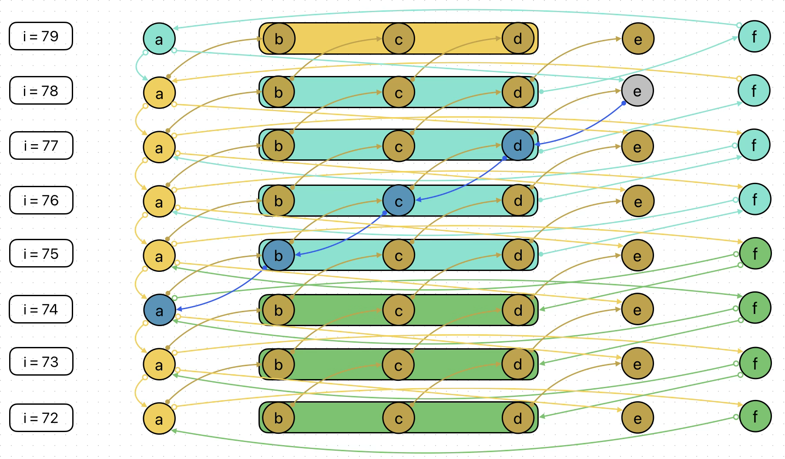

# Analyse de SHA-1

Ce document est une réflexion sur l'impossibilité d'inverser un hash SHA-1 sans force brute.

## Menu
 - [Rappels](#rappels)
 - [L'équation de e](#léquation-de-e)
 - [L'équation de w](#léquation-de-w)
 - [Constance](#constance)
 - [Possibilités](#possibilités)
 - [Rotation](#rotation)
 - [e et w](#e-et-w)
 - [Propagation d'erreur](#propagation-derreur)
 - [Valeur non bornée](#valeur-non-bornée)

## Rappels

### Relations des registres vers l'avant
```math
registers = 
\begin{cases}
a_i = (\_left\_rotate(a_{i-1}, 5) + f_i + e_{i-1} + k_{i} + w_i) \land 4294967295 \\
a_i = (\left( (a_{i-1} \ll 5) \mid (a_{i-1} \gg 27) \right) + f_i + e_{i-1} + k_{i} + w_i) \land 4294967295 \\
b_i = (a_{i-1}) \land 4294967295 \\
c_i = (\_left\_rotate(b_{i-1}, 30)) \land 4294967295 \\
c_i = ((b_{i-1} \ll 30) \mid (b_{i-1} \gg 2)) \land 4294967295 \\
d_i = (c_{i-1}) \land 4294967295 \\
e_i = (d_{i-1}) \land 4294967295
\end{cases}
```
<br>

if $0 \leqslant i \lt 20$ :
```math
f_i = (d_{i-1} \oplus \left( b_{i-1} \land (c_{i-1} \oplus d_{i-1}) \right)) \land 4294967295
```

if $20 \leqslant i \lt 40$ :
```math
f_i = (b_{i-1} \oplus c_{i-1} \oplus d_{i-1}) \land 4294967295
```

if $40 \leqslant i \lt 60$ :
```math
f_i = ((b_{i-1} \land c_{i-1}) \lor (b_{i-1} \land d_{i-1}) \lor (c_{i-1} \land d_{i-1})) \land 4294967295
```

if $60 \leqslant i \lt 80$ :
```math
f_i = (b_{i-1} \oplus c_{i-1} \oplus d_{i-1}) \land 4294967295
```

### Relations des registres vers l'arrière
```math
registers =
\begin{cases}
d_{i-1} = (e_i) \land 4294967295 \\
c_{i-1} = (d_i) \land 4294967295 \\
b_{i-1} = (\_left\_rotate(c_i, 2)) \land 4294967295 \\
b_{i-1} = ((c_i \ll 2) \mid (c_i \gg 30)) \land 4294967295 \\
a_{i-1} = (b_i) \land 4294967295
\end{cases}
```

if $0 \leqslant i \lt 20$ :
```math
\begin{align}
f_{i-1} &= (e_i \oplus \left( \_left\_rotate(c_i, 2) \land (d_i \oplus e_i) \right)) \land 4294967295 \\
f_{i-1} &= (e_i \oplus \left( \left( (c_i \ll 2) \mid (c_i \gg 30) \right) \land (d_i \oplus e_i) \right)) \land 4294967295
\end{align}
```

if $20 \leqslant i \lt 40$ :
```math
\begin{align}
f_{i-1} &= (\_left\_rotate(c_i, 2) \oplus d_i \oplus e_i) \land 4294967295 \\
f_{i-1} &= (\left( (c_i \ll 2) \mid (c_i \gg 30) \right) \oplus d_i \oplus e_i) \land 4294967295
\end{align}
```

if $40 \leqslant i \lt 60$ :
```math
\begin{align}
f_{i-1} &= ((\_left\_rotate(c_i, 2) \land d_i) \lor (\_left\_rotate(c_i, 2) \land e_i) \lor (d_i \land e_i)) \land 4294967295 \\
f_{i-1} &= ((\left( (c_i \ll 2) \mid (c_i \gg 30) \right) \land d_i) \lor (\left( (c_i \ll 2) \mid (c_i \gg 30) \right) \land e_i) \lor (d_i \land e_i)) \land 4294967295
\end{align}
```

if $60 \leqslant i \lt$ 80 :
```math
\begin{align}
f_{i-1} &= (\_left\_rotate(c_i, 2) \oplus d_i \oplus e_i) \land 4294967295 \\
f_{i-1} &= (\left( (c_i \ll 2) \mid (c_i \gg 30) \right) \oplus d_i \oplus e_i) \land 4294967295
\end{align}
```

## L'équation de e

Dans SHA-1, certaines valeurs sont perdues entre les tours : la valeur du registre $e$ au tour $i$ n'est plus accessible au tour $i + 1$.

Néanmoins, il est possible d'utiliser l'équation de $a_{i+1}$ pour retrouver la valeur de $e_i$, en supposant que nous connaissons les données initiales ($w$). Il peut sembler que la valeur du registre $e_i$ est perdue au tour $i + 1$, mais la définition de $a_{i + 1}$ est :

```math
\begin{align}
a_{i+1} &= (\_left\_rotate(a_i, 5) + f_{i+1} + e_i + k_{i+1} + w_{i+1}) \land 4294967295 \\
a_{i+1} &= (\left( (a_i \ll 5) \mid (a_i \gg 27) \right) + f_{i+1} + e_i + k_{i+1} + w_{i+1}) \land 4294967295
\end{align}
```

Ce qui est l'équivalent de :

```math
\begin{align}
a_{i+1} &= (\_left\_rotate(b_{i+1}, 5) + f_{i+1} + e_i + k_{i+1} + w_{i+1}) \land 4294967295 \\
a_{i+1} &= (\left( (b_{i+1} \ll 5) \mid (b_{i+1} \gg 27) \right) + f_{i+1} + e_i + k_{i+1} + w_{i+1}) \land 4294967295
\end{align}
```
<br>

Et, étant donné que nous connaissons les données initiales, nous connaissons aussi $w_i$, l'unique inconnue restante dans l'équation est donc $e_i$ :

```math
\begin{align}
e_i &= (a_{i+1} - \left( \_left\_rotate(a_i, 5) + f_{i+1} + k_{i+1} + w_{i+1} \right)) \land 4294967295 \\
e_{i} &= (a_{i+1} - \left( \left( (a_i \ll 5) \mid (a_i \gg 27) \right) + f_{i+1} + k_{i+1} + w_{i+1} \right)) \land 4294967295
\end{align}
```

## L'équation de w

Dans SHA-1, $w_0$ à $w_{15}$ correspondent aux données initiales (non transformées), et le reste, $w_{16}$ à $w_{79}$ sont calculés grâce aux données initiales.  
L'opération de transformation de $w_{16}$ à $w_{79}$ est :  

```math
\begin{align}
w_{i} &= (\_left\_rotate( w_{i - 3} \oplus w_{i - 8} \oplus w_{i - 14} \oplus w_{i - 16},\, 1)) \land 4294967295 \\
w_{i} &= (\left( \left( w_{i - 3} \oplus w_{i - 8} \oplus w_{i - 14} \oplus w_{i - 16} \right) \ll 1 \right) \mid \left( \left( w_{i - 3} \oplus w_{i - 8} \oplus w_{i - 14} \oplus w_{i - 16} \right) \gg 31 \right)) \land 4294967295
\end{align}
```
<br>
Et l'équation est :

```math
\begin{align}
w_{i} &= (a_{i} - ( \_left\_rotate(a_{i-1},\, 5) + f_{i} + e_{i-1} + k_{i})) \land 4294967295 \\
w_{i} &= (a_{i} - (((a_{i-1} \ll 5) \mid (a_{i-1} \gg 27)) + f_{i} + e_{i-1} + k_{i})) \land 4294967295
\end{align}
```
<br>

Mais même si nous connaissons le résultat de l'équation ($w_i$), il y a toujours trop de possibilités.  
Par exemple, prenons $w_{50} = 1000$ :

```math
\begin{align}
w_{50} = (\_left\_rotate( w_{47} \oplus w_{42} \oplus w_{36} \oplus w_{34},\, 1)) \land 4294967295 = 1000
\end{align}
```

Dans ce type d'équation — ((a ^ b ^ c ^ d) << 1) | ((a ^ b ^ c ^ d) >> 31) = x — où $a, b, c, d$ sont des valeurs de 32-bits comprises dans l'intervalle $[0;4294967295]$, le nombre total de possibilités pour $a, b, c$ est $(2^{32})^3= 2^{96} = 79228162514264337593543950336$.

## Constance

Dans SHA-1, il y a aussi de la constance au niveau des valeurs de départ :

```math
\begin{align}
a_0 &= 1732584193 \\
b_0 &= 4023233417 \\
c_0 &= 2562383102 \\
d_0 &= 271733878 \\
e_0 &= 3285377520
\end{align}
```

Et donc :

```
i=5  : a =           , b =           , c =           , d =           , e =
i=4  : a =           , b =           , c =           , d =           , e = 1506887872
i=3  : a =           , b =           , c =           , d = 1506887872, e = 2079550178
i=2  : a =           , b =           , c = 1506887872, d = 2079550178, e = 2562383102
i=1  : a =           , b = 1732584193, c = 2079550178, d = 2562383102, e = 271733878
i=0  : a = 1732584193, b = 4023233417, c = 2562383102, d = 271733878 , e = 3285377520
```

## Possibilités

### Un registre
$2^{32} = 4294967296$

### De $w_0$ à $w_{15}$

$(2^{32})^{16} = 13407807929942597099574024998205846127479365820592393377723561443721764030073546976801874298166903427690031858186486050853753882811946569946433649006084096$

### De $w_0$ à $w_{79}$

$(2^{32})^{80} = 433300210274926779301235722995130529126851924312253566276831366547097655953268278873591999368453759375352459120642109169274240110620843517970102311224458427564046616227161115801662152359395451958893835480905010246703239443701925453743683726938789767940577524555724362397039358587448248740993955708382317083531851133758531532844694304737183093418571190053292997716413815714417740434254315670267335553209606545389900958653541702218767662872949109999460596999125719155768466778443229719919179735890978537026576050107500869340314188887101095263339865901080787145771915722368720844521851040375582291274824574444462419841916186875058374404329003250698574832235855871168399140082282900718430116575617097058691735266917705341386171618452673063526784039252631042036988932549246976$

## Rotation

Nous pouvons faire pivoter le problème de $w$ à $f$ quand $20 \leqslant i \lt 40$ et quand $60 \leqslant i \lt 80$ :

```math
\begin{align}
f_i &= (b_{i-1} \oplus c_{i-1} \oplus d_{i-1}) \land 4294967295 \\
b_{i-1} &= (f_i \oplus c_{i-1} \oplus d_{i-1}) \land 4294967295 \\
c_{i-1} &= (b_{i-1} \oplus f_i \oplus d_{i-1}) \land 4294967295 \\
d_{i-1} &= (b_{i-1} \oplus c_{i-1} \oplus f_i) \land 4294967295 \\

e_i &= d_{i-1} = (b_{i-1} \oplus c_{i-1} \oplus f_i) \land 4294967295 \\
e_{i-1} &= d_{i-2} = (b_{i-2} \oplus c_{i-2} \oplus f_{i-1}) \land 4294967295 \\
e_{i-2} &= d_{i-3} = (b_{i-3} \oplus c_{i-3} \oplus f_{i-2}) \land 4294967295 \\

a_i &= (\_left\_rotate(a_{i-1}, 5) + f_i + (b_{i-2} \oplus c_{i-2} \oplus f_{i-1}) + k_{i} + w_i) \land 4294967295 \\
w_i &= (a_{i} - (\_left\_rotate(a_{i-1},\, 5) + f_{i} + (d_{i-2} = b_{i-2} \oplus c_{i-2} \oplus f_{i-1}) + k_{i})) \land 4294967295 \\
w_{i-1} &= (b_{i} - (\_left\_rotate(\_left\_rotate(c_i,\, 2),\, 5) + f_{i-1} + (b_{i-3} \oplus c_{i-3} \oplus f_{i-2}) + k_{i-1})) \land 4294967295 \\
f_{i-1} &= (e_{i-1} \oplus (\_left\_rotate(c_i,\, 2) \land (d_{i-1} \oplus e_{i-1}))) \land 4294967295 \\
f_{i-1} &= ((b_{i-2} \oplus c_{i-2} \oplus f_{i-1}) \oplus (\_left\_rotate(c_i,\, 2) \land ((d_{i-1} \oplus (b_{i-2} \oplus c_{i-2} \oplus f_{i-1})))) \land 4294967295 \\
w_{i+1} + (b_{i-1} \oplus c_{i-1} \oplus f_i) &= (a_{i+1} - (\_left\_rotate(a_i,\, 5) - f_{i+1} - k_{i+1})) \land 4294967295
\end{align}
```

## e et w

Cette formule peut calculer la taille des deux inconnues :

```math
\begin{align}
w_{i+1} + e_i &= (a_{i+1} - (\_left\_rotate(a_i,\, 5) + f_{i+1} + k_{i+1})) \land 4294967295 \\
w_i + e_{i-1} &= (a_i - (\_left\_rotate(a_{i-1},\, 5) + f_i + k_i)) \land 4294967295
\end{align}
```

Par exemple :
```math
\begin{align}
(w_{79} + e_{78}) \land 4294967295 = 2554260970
\end{align}
```

Le nombre total de possibilités de valeurs pour ceci est $4294967296$, au lieu de $(2^{32})^2 = 18446744073709551616$.

## Propagation d'erreur

A partir d'ici, il faut faire des hypothèses pour $w_{i+1} + e_i$.  
Le problème est plutôt simple : on peut descendre avec nos erreurs, mais il faut réussir à remonter et prouver que la valeur choisie est fausse.  

Voici un schéma de la propagation de $e\prime_{78}$ :



### Explications

#### Premier chemin

Premièrement, nous pouvons voir le chemin classique (en bleu foncé) :
```math
e \prime _{78} \to d \prime _{77} \to c \prime _{76} \to b \prime _{75} \to a \prime _{74}
```

$a\prime_{74}$ est intéressant car :
```math
a_{74} = (\_left\_rotate(a_{73}, 5) + f_{74} + e_{73} + k_{74} + w_{74}) \land 4294967295
```
Autrement dit :
```math
(\_left\_rotate(a_{73}, 5) + f_{74} + e_{73} + k_{74} + w_{74}) \land 4294967295 = a \prime _{74}
```

Et donc, toutes ces valeurs sont altérées par $a\prime_{74}$ car elles doivent êtres cohérentes avec ce résultat qui ne l'est pas forcément.

#### Deuxième chemin

Si nous nous concentrons uniquement sur le début du premier chemin :
```math
e \prime _{78} \to d \prime _{77}
```

C'est intéressant car :
```math
f_{78} = (b_{77} \oplus c_{77} \oplus d_{77}) \land 4294967295
```

Et donc niveau propagation :
```math
f\prime_{78} = (b_{77} \oplus c_{77} \oplus d\prime_{77}) \land 4294967295
```

Ce qui veut directement dire que si le choix n'est pas le bon :
```math
f\prime_{78} \neq f_{78}
```

Alors, la question devient : comment prouver que $f\prime_{78} \neq f_{78}$ ?  
Nous ne pouvons pas connaître $f_{78}$, car sinon nous pourrions en déduire $d\prime_{77} \to e\prime_{78}$.  
<br>
Il faut donc réussir à prouver que $f\prime_{78} \neq f_{78}$ sans connaître la valeur de $f_{78}$.  
<br>

Maintenant, si nous continuons depuis ce $f\prime_{78}$, et que nous reprenons la définition de $a_{78}$ :
```math
a_{78} = (\_left\_rotate(a_{77}, 5) + f_{78} + e_{77} + k_{78} + w_{78}) \land 4294967295
```

Donc :
```math
a\prime_{78} = (\_left\_rotate(a_{77}, 5) + f\prime_{78} + e_{77} + k_{78} + w_{78}) \land 4294967295
```

Encore une fois, pour que cette égalité soit correcte, certaines valeurs vont devoir changer à cause de $f\prime_{78}$.  
Mais donc, théoriquement la valeur de $a_{78}$ ne devrait pas changer :
```math
a\prime_{78} = a_{78}
```

C'est plutôt ce qu'elle contient, si $f\prime_{78} \neq f_{78}$ : alors une variable de la définition de $a_{78}$ a forcément changé.  

Et tout ceci s'applique aussi pour $f_{77}$ et $f_{76}$.

## Valeur non bornée

Prenons un exemple :
```
i=79 : a = 1720377700, b = 1300218179, c = 2933058290, d = 1176787107, e = 3928391792, w =  
i=78 : a = 1300218179, b = 3142298570, c = 1176787107, d = 3928391792, e =           , w =
```

```math
\begin{align}
w_{79} + e_{78} &= (a_{79} - (\_left\_rotate(a_{78},\, 5) + f_{79} + k_{79})) \land 4294967295 \\
w_{79} + e_{78} &= (1720377700 - (\_left\_rotate(1300218179,\, 5) + 390689561 + 3395469782)) \land 4294967295 \\
w_{79} + e_{78} &= -5018057716 \land 4294967295 \\
w_{79} + e_{78} &= 3571876876
\end{align}
```

Le but est de réduire les $2^{32}$ possibilités de couples.

```
i=79 : a = 1720377700, b = 1300218179, c = 2933058290, d = 1176787107, e = 3928391793, w =  
i=78 : a = 1300218179, b = 3142298570, c = 1176787107, d = 3928391793, e =           , w =  
```

```math
\begin{align}
w_{79} + e_{78} &= (1720377700 - (\_left\_rotate(1300218179,\, 5) + 390689560 + 3395469782)) \land 4294967295 \\
w_{79} + e_{78} &= (-5018057715) \land 4294967295 \\
w_{79} + e_{78} &= 3571876877
\end{align}
```

Ici, il y a par défaut $2^{32}$ combinaisons possibles.  
Mais ce que l'on ne prend pas en compte, c'est le résultat non borné : $-5018057715$.

<br>

On sait que $-5018057715 \land 4294967295 = (w_{79} + e_{78}) \land 4294967295$.  
Par contre, ça ne signifie pas que $-5018057715 = w_{79} + e_{78}$.  

De toute façon, ce n'est pas possible car les registres sont compris dans l'intervalle $[0;4294967295]$.