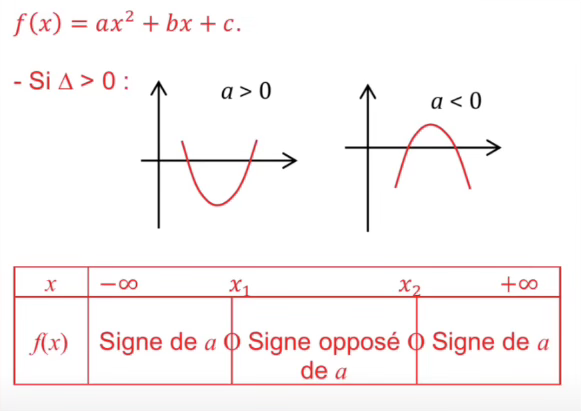
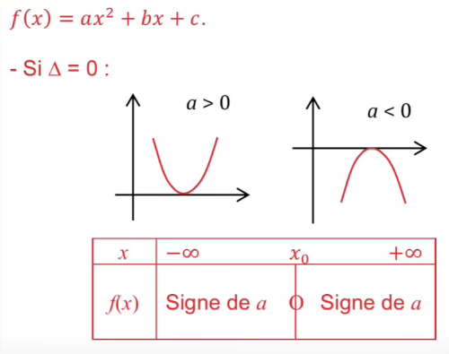
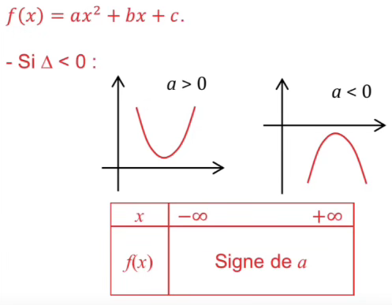
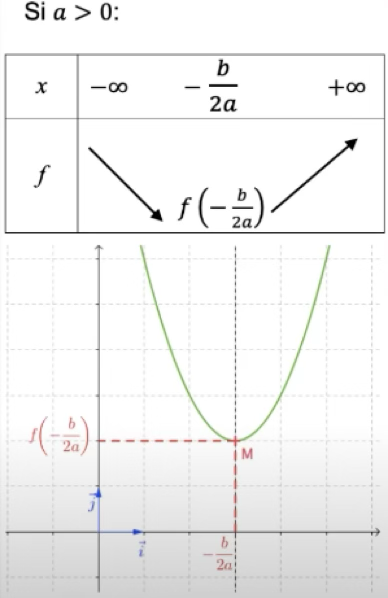
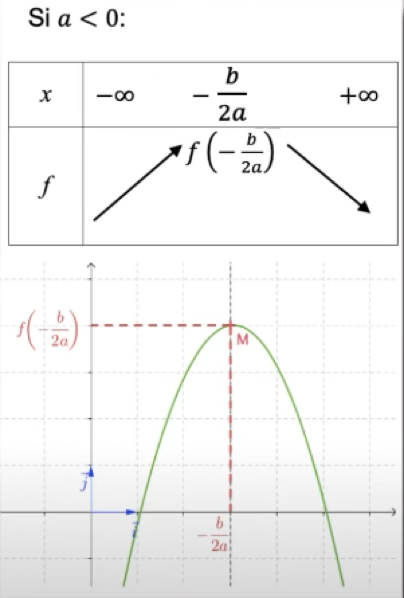

# Fonction affine
Forme : $ax + b$  
Où :
- $a$ est le coefficient directeur de la droite.
- $b$ est l'ordonné à l'origine

## Signe d'une fonction affine

### Méthode 1
Résoudre $ax + b > 0$

### Méthode 2
Résoudre $ax + b = 0$, on obtient la racine $r$

### Méthode 3
Si $a \neq 0$, la racine est $r = \frac{-b}{a}$

Puis on dresse le tableau de signe de $f(x)$ :
- Si $a > 0$, le signe de la fonction est négatif puis nul (en $r$) et enfin positif.
- Si $a < 0$, le signe de la fonction est positif puis nul (en $r$) et enfin négatif.
- Si $a = 0$, le signe de la fonction est celui de l'ordonné à l'origine ($b$).

## Variation d'une fonction affine
La courbe représentative d'une fonction affine est une droite.  
Il n'y a donc qu'une seule variation, elle dépend uniquement du signe du coefficient directeur ($a$).

- Si $a > 0$, la fonction est croissante.
- Si $a < 0$, la fonction est décroissante.
- Si $a = 0$, la fonction est constante.

# Fonction polynôme du second degré
Forme : $ax^2 + bx + c$  
Où :
- $a$, $b$, $c$ sont des coefficients réels.
- $a \neq 0$

## Signe d'une fonction polynôme du second degré

1) On commence par calculer le déterminant : $\Delta = b^2 - 4ac$

- Si $\Delta > 0$ :  
L'équation $ax^2 + bx + c = 0$ a deux solutions.  
Il y aura donc deux points de la courbe qui toucheront l'axe des abscisses.  
On appellera les deux racines réelles $r_1$ et $r_2$ :  
$r_1 = \frac{-b - \sqrt{\Delta}}{2a}$  
$r_2 = \frac{-b + \sqrt{\Delta}}{2a}$  

($x_1$ et $x_2$ sur l'image)  

- Si $\Delta = 0$ :  
L'équation $ax^2 + bx + c = 0$ a une unique solution.  
Ce qui veut dire que la courbe va toucher l'axe des abscisses en un point.  
On appellera la racine $r$ :  
$r = \frac{-b}{2a}$  
($x_0$ sur l'image)  

- Si $\Delta < 0$ :  
L'équation $ax^2 + bx + c = 0$ n'a pas de solution réelle.  
Ce qui veut dire que la courbe ne peut pas traverser l'axe des abscisses.  
La fonction polynôme du second degré ne changera jamais de signe.

## Variation(s) d'une fonction polynôme du second degré
- Si $a > 0$ :  
$f$ admet un minimum pour $x = \alpha$, ce minimum est égal à $\beta$.  
- Si $a < 0$ :  
$f$ admet un maximum pour $x = \alpha$, ce maximum est égal à $\beta$.  
$\alpha = \frac{-b}{2a}$  
$\beta = f(\alpha)$  

# Fonction qui n'est ni affine ni polynôme du second degré

## Signe de la fonction (si c'est un produit)
1) Déterminer le signe de chaque facteur.
2) Dresser le tableau de signe de chaque facteur.
3) Appliquer la règle des produits.
4) En déduire le signe de $f(x)$

## Signe de la fonction (si c'est un quotient de deux fonctions)
1) Déterminer le signe du numérateur et du dénominateur.
2) Dresser le tableau de signe du numérateur et du dénominateur.
3) Appliquer la règle du signe des quotients. (Attention, division par zéro est une valeur interdite de la fonction).
4) En déduire le signe de $f(x)$

## Signe d'une fonction qui n'est ni un produit ni un quotient
- Cas 1 : On ramène à un produit en factorisant.
- Cas 2 : Si c'est impossible, on chercher à résoudre $f(x) = 0$

## Variation(s) d'une fonction dérivable
1) Déterminer $f \prime (x)$
2) Déterminer le signe de $f \prime (x)$
3) En déduire les variations de $f(x)$

Soit $f$ une fonction dérivable définie sur un intervalle $I$, alors :
- Si pour tout $x \in I, f \prime (x) > 0$, alors f est strictement croissante sur $I$
- Si pour tout $x \in I, f \prime (x) < 0$, alors f est strictement décroissante sur $I$
- Si pour tout $x \in I, f \prime (x) = 0$, alors f est constante sur $I$  

Réciproquement :

- Si $f$ est strictement croissante sur $I$, alors, pour tout $x \in I, f \prime (x) \geqslant 0$
- Si $f$ est strictement décroissante sur $I$, alors, pour tout $x \in I, f \prime (x) \leqslant 0$
- Si $f$ est constante sur $I$, alors, pour tout $x \in I, f \prime (x) = 0$